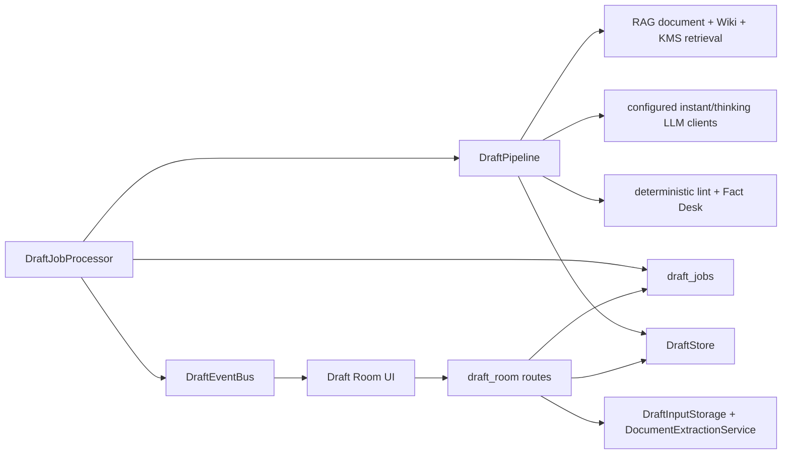

# Draft Room — Implementation Specification

**Status:** Approved for phased implementation

**Source:** [`INVESTIGATION.md`](./INVESTIGATION.md)

**Audience:** An implementation agent that must be able to complete the work without making product or architecture decisions.

**Target stack:** FastAPI + SQLite backend; React + TypeScript + Vite frontend.

The words **MUST**, **MUST NOT**, **SHOULD**, and **MAY** are normative. If current code conflicts with this specification, stop and surface the conflict rather than silently changing scope.

---

## 1. Delivery contract

1. Implement the PR sequence in §18 in order. Do not expose Draft Room in navigation until PR 3's factuality and human-approval gates are complete.
2. Every database query that touches a draft MUST be scoped by both `draft_id` and `created_by`. Vault-derived operations MUST also re-check current vault permission.
3. Draft inputs MUST NOT be inserted into `files`, LanceDB, Wiki, KMS, the file watcher, or normal document-processing queues.
4. Chat sessions and `useChatStore` MUST NOT be reused as draft persistence.
5. The final Fact Desk is the last semantic gate. Any later semantic change invalidates the fact result and returns the revision through Copy, Standards, and Fact.
6. Automated work MUST end in `needs_review`. Only an authenticated human owner can mark a specific revision `ready`.
7. A citation label or lexical-overlap score MUST NOT be presented as proof that a claim is true.
8. No AI-writing detector or detector-evasion score may be added.
9. No hidden chain-of-thought may be stored or returned. Store structured decisions, short rationales, evidence, and user-visible findings only.
10. New behavior ships with behavior-level tests, including negative permissions, cross-vault isolation, cancellation, restart recovery, prompt injection, and cascade cleanup.

## 2. Product scope

### 2.1 Goals

- Create a private drafting project against one selected vault.
- Upload one or more manuscripts, references, style exemplars, background files, or challenge documents.
- Rewrite a primary manuscript or compose a new piece using a structured assignment brief.
- Retrieve vault document, Wiki, and KMS evidence without indexing draft inputs.
- Produce inspectable research, outline, section, lint, copy, standards, and factuality artifacts.
- Preserve revisions, evidence snapshots, findings, and human actions.
- Export approved or unapproved revisions as Markdown with an audit event.
- Promote an input or revision into the normal vault ingestion path only through an explicit action requiring vault `write`.

### 2.2 Non-goals

- Real-time multi-user collaborative editing.
- A chat-based drafting mode.
- Automatic publication or automatic `ready` status.
- AI-detector scoring or detector evasion.
- Web research outside the selected vault in the initial implementation.
- DOCX/PDF export in the initial implementation.
- Per-role model routing in the initial implementation.
- Reusing draft inputs as vault-grounding evidence unless the user explicitly promotes them.

### 2.3 Locked decisions

| Decision | Required behavior |
|---|---|
| Name and route | **Draft Room**, `/draft-room`, `/draft-room/:draftId` |
| Ownership | User-owned and private |
| Vault permission | `read` to create/use; `write` to promote/share/publish |
| Input persistence | Dedicated `draft_inputs`; never `files` |
| MVP export | Markdown only |
| MVP editor/diff | Existing textarea primitives plus the `diff` package for a read-only word/line diff; no Monaco or CodeMirror |
| Orchestration | Deterministic Python state machine; logical roles, not agents |
| Completion | Every run ends `needs_review`; human-only `ready` |
| Quality language | Editorial standards, not “humanizer” or detector evasion |
| Model routing | Existing instant/thinking clients first; optional role routing in PR 4 |
| Attachment retention | No automatic TTL initially; archive retains files; whole-draft delete purges the project and derivatives |
| Factual conflicts | Always surface; source priority never silently decides truth |
| Provider policy | Disabled until an administrator enables Draft Room and explicitly allowlists model origins |

## 3. User journeys

### 3.1 Create and compile a rewrite

1. User opens `/draft-room` and selects **New draft**.
2. The active vault is preselected. The user may choose another vault they can read.
3. User enters a title and assignment brief.
4. User uploads at least one input and assigns each a role, authority, and optional as-of date.
5. Rewrite mode requires exactly one `primary_input_id` whose role is `manuscript`.
6. The UI waits until all inputs are `ready`; failed inputs show a sanitized error and retry/delete actions.
7. User selects **Compile draft**. Duplicate clicks return the existing active job rather than creating another.
8. The UI shows the stage rail and refetches canonical state after SSE events.
9. The completed revision opens in `needs_review`, never `ready`.
10. User reviews diff, sources, claims, and findings; edits create a new manual revision and invalidate earlier factual approval.
11. User resolves or explicitly waives waivable blockers, then marks the selected revision `ready`.

### 3.2 Resume after refresh or restart

- REST state is canonical. SSE is only a notification mechanism.
- Refreshing the browser reconstructs project, latest revision, current job, and stage artifacts from SQLite.
- On application restart, a `running` job is reset to `pending` and resumes from the latest completed stage whose input hash still matches.
- Completed model stages MUST NOT be repeated merely because the process restarted.

### 3.3 Manual edit

- Editing occurs in a Markdown textarea.
- **Save revision** creates a new immutable `draft_revisions` row with `source='manual'` and the prior revision as parent.
- A manual revision sets project status to `needs_review`, clears `ready_at`, and has `fact_status='not_run'`.
- The user may re-run the full pipeline against that revision; PR 4 may add section-only reruns.

### 3.4 Export and promote

- Export downloads exactly the selected revision, not an implicit latest revision.
- Export records actor, revision, timestamp, content hash, and format.
- Promotion requires vault `write`, creates a normal vault document, and enters the existing ingestion/indexing workflow.
- Promotion MUST NOT mutate the draft input/revision or pretend the promoted document is already indexed.

## 4. Architecture and boundaries



### 4.1 New backend modules

| File | Responsibility |
|---|---|
| `backend/app/api/routes/draft_room.py` | Pydantic contracts, authorization, CSRF/rate limits, HTTP/SSE endpoints |
| `backend/app/services/draft_store.py` | All SQLite CRUD, atomic claims/transitions, revision numbering, event records |
| `backend/app/services/draft_input_storage.py` | Safe private paths, streaming writes, reads, deletes, cleanup |
| `backend/app/services/draft_deletion.py` | Two-phase project/input tombstones, parent-delete integration, orphan reconciliation |
| `backend/app/services/document_extraction.py` | Shared parse-only extraction wrapper around existing `DocumentParser` |
| `backend/app/services/draft_job_processor.py` | Durable parse/compile worker, orphan recovery, cooperative cancellation, retry |
| `backend/app/services/draft_pipeline.py` | Ordered stage execution and loop rules |
| `backend/app/services/draft_research.py` | Facet extraction and vault/Wiki/KMS evidence snapshots |
| `backend/app/services/draft_quality.py` | Deterministic boilerplate and advisory style checks |
| `backend/app/services/draft_prompts.py` | Versioned role prompts and Pydantic response schemas |
| `backend/app/services/draft_events.py` | In-process, bounded project event bus |

### 4.2 Existing backend modules changed

- `backend/app/models/database.py`: schema, indexes, idempotent migration, `run_migrations` registration.
- `backend/app/main.py`: import and register `draft_room.router` with `prefix="/api"`.
- `backend/app/lifespan.py`: construct/start/stop `DraftJobProcessor`; pass the existing pool, retrieval services, and LLM clients explicitly.
- `backend/app/api/routes/vaults.py`, `backend/app/api/routes/users.py`, and document/Wiki/KMS source mutations: invoke Draft Room parent/source cleanup or evidence invalidation so cascades cannot orphan bytes and changed/deleted sources cannot leave Ready drafts silently valid.
- `backend/app/services/rag_engine.py`: add `retrieve_sources(query, vault_id, *, limit, source_kinds=None) -> RAGRetrievalResult` using the normalized union and failure contract below; refactor `query_retrieve_only` to delegate to it and project its legacy return shape rather than exposing `_execute_retrieval` to Draft Room.
- `backend/app/services/citation_validator.py`: support `[D#]` only through an explicit Draft input registry defaulting to empty, and add an honestly named `calculate_citation_lexical_overlap` adapter for Draft Room; existing chat behavior and its legacy wire field must remain unchanged.
- `backend/app/config.py`, `.env.example`, `docker-compose.yml`: only the limits listed in §15; run the config contract audit.

### 4.3 Prohibited coupling

- `DraftPipeline` MUST NOT call FastAPI route functions.
- `DraftJobProcessor` MUST NOT hold a SQLite connection while awaiting an LLM or embedding request.
- Draft Room MUST NOT call private `RAGEngine._execute_retrieval`.
- Draft Room MUST NOT construct a second global RAG engine.
- Frontend draft state MUST NOT be stored in chat messages or upload queue records.

### 4.4 Public retrieval contract

`RAGSource` is a discriminated Pydantic union. Every variant has `source_kind`, `title`, `passage`, `retrieval_score`, `source_content_sha256`, and source update/date metadata, plus exactly these durable identities:

- `DocumentRAGSource`: `source_kind='document'`, required `file_id` and `chunk_uid`, optional page/section;
- `WikiRAGSource`: `source_kind='wiki'`, required `wiki_page_id`, optional `wiki_claim_id`, and optional section; page-level results are valid when `wiki_claim_id` is null;
- `KMSRAGSource`: `source_kind='kms'`, required `kms_entry_id` and optional section.

The default `source_kinds` is the immutable set `{'document','wiki','kms'}`. Reject unknown or empty sets. Chat memory, Draft inputs, and any cross-vault source are never part of this method. A result is `RAGRetrievalResult(sources, requested_source_kinds, successful_source_kinds, failed_source_kinds, status)`, where `status` is `ok`, `partial`, or `unavailable`. Each backend adapter reports failure separately; no adapter may convert an exception, timeout, missing index, or provider outage into an empty successful list.

`source_only=true` is legal only when all requested kinds completed successfully and returned zero authorized sources. If every kind fails, or a partial result contains no evidence, Research retries according to §10.2 and then fails the job with `retrieval_unavailable`. A partial result with evidence may produce an inspectable revision, but it records `retrieval_status='partial'`, creates a non-waivable `retrieval_partial` blocker, and cannot pass Fact or become Ready until a new full Research run succeeds. Existing `query_retrieve_only` behavior remains wire-compatible; its projection may log partial failure without exposing Draft-specific types.

## 5. Persistent data model

Add the following tables through three ordered, idempotent migrations registered in `run_migrations()`: PR 1 `migrate_add_draft_room_core` creates `drafts`, `draft_inputs`, `draft_revisions`, `draft_jobs`, and `draft_events`; PR 2 `migrate_add_draft_room_pipeline` creates `draft_job_stages` and `draft_evidence`; PR 3 `migrate_add_draft_room_factuality` creates `draft_claims`, `draft_claim_sources`, and `draft_findings`. Each migration MUST create every table/index in its group when absent, tolerate repeat execution, and preserve existing data. Add the same final schema to `SCHEMA` so fresh databases and migrated databases converge.

### 5.1 `drafts`

```sql
CREATE TABLE IF NOT EXISTS drafts (
    id INTEGER PRIMARY KEY AUTOINCREMENT,
    vault_id INTEGER NOT NULL REFERENCES vaults(id) ON DELETE CASCADE,
    created_by INTEGER NOT NULL REFERENCES users(id) ON DELETE CASCADE,
    title TEXT NOT NULL,
    mode TEXT NOT NULL CHECK (mode IN ('rewrite','compose')),
    status TEXT NOT NULL DEFAULT 'draft' CHECK (status IN (
        'draft','queued','running','needs_review','ready','failed','cancelled','archived'
    )),
    tier TEXT NOT NULL DEFAULT 'standard' CHECK (tier IN (
        'standard','high_stakes','sensitive'
    )),
    brief_json TEXT NOT NULL DEFAULT '{}',
    lock_version INTEGER NOT NULL DEFAULT 1,
    ready_revision_id INTEGER,
    ready_by INTEGER REFERENCES users(id) ON DELETE SET NULL,
    ready_at TIMESTAMP,
    archived_at TIMESTAMP,
    created_at TIMESTAMP NOT NULL DEFAULT CURRENT_TIMESTAMP,
    updated_at TIMESTAMP NOT NULL DEFAULT CURRENT_TIMESTAMP
);
CREATE INDEX IF NOT EXISTS idx_drafts_owner_updated
    ON drafts(created_by, updated_at DESC);
CREATE INDEX IF NOT EXISTS idx_drafts_owner_vault_status
    ON drafts(created_by, vault_id, status);
```

`ready_revision_id` is application-validated against the same draft because SQLite cannot express that composite invariant with this layout. The store MUST validate it transactionally.

### 5.2 `draft_inputs`

```sql
CREATE TABLE IF NOT EXISTS draft_inputs (
    id INTEGER PRIMARY KEY AUTOINCREMENT,
    draft_id INTEGER NOT NULL REFERENCES drafts(id) ON DELETE CASCADE,
    role TEXT NOT NULL CHECK (role IN (
        'manuscript','reference','style','background','challenge'
    )),
    authority TEXT NOT NULL DEFAULT 'unknown' CHECK (authority IN (
        'primary','official','secondary','user_asserted','unknown'
    )),
    as_of_date TEXT,
    original_name TEXT NOT NULL,
    stored_name TEXT NOT NULL,
    extension TEXT NOT NULL,
    media_type TEXT,
    size_bytes INTEGER NOT NULL CHECK (size_bytes >= 0),
    content_sha256 TEXT NOT NULL,
    storage_relpath TEXT NOT NULL UNIQUE,
    parsed_text TEXT,
    parsed_text_sha256 TEXT,
    parsed_char_count INTEGER CHECK (parsed_char_count IS NULL OR parsed_char_count >= 0),
    parse_status TEXT NOT NULL DEFAULT 'pending' CHECK (parse_status IN (
        'pending','parsing','ready','failed','cancelled'
    )),
    parse_error TEXT,
    locked_spans_json TEXT NOT NULL DEFAULT '[]',
    created_at TIMESTAMP NOT NULL DEFAULT CURRENT_TIMESTAMP,
    updated_at TIMESTAMP NOT NULL DEFAULT CURRENT_TIMESTAMP,
    UNIQUE(draft_id, content_sha256)
);
CREATE INDEX IF NOT EXISTS idx_draft_inputs_draft_status
    ON draft_inputs(draft_id, parse_status);
```

`role` describes intended use. It MUST NOT imply that content is true. `authority` and `as_of_date` are separate metadata. Factual conflicts are always recorded even when the brief has a preferred drafting source.

### 5.3 `draft_revisions`

```sql
CREATE TABLE IF NOT EXISTS draft_revisions (
    id INTEGER PRIMARY KEY AUTOINCREMENT,
    draft_id INTEGER NOT NULL REFERENCES drafts(id) ON DELETE CASCADE,
    parent_revision_id INTEGER REFERENCES draft_revisions(id) ON DELETE SET NULL,
    job_id INTEGER,
    revision_no INTEGER NOT NULL,
    source TEXT NOT NULL CHECK (source IN ('pipeline','manual')),
    content_md TEXT NOT NULL,
    content_sha256 TEXT NOT NULL,
    sections_json TEXT NOT NULL DEFAULT '[]',
    citations_json TEXT NOT NULL DEFAULT '[]',
    qa_summary_json TEXT NOT NULL DEFAULT '{}',
    fact_status TEXT NOT NULL DEFAULT 'not_run' CHECK (fact_status IN (
        'not_run','running','passed','findings','invalidated'
    )),
    is_current INTEGER NOT NULL DEFAULT 0 CHECK (is_current IN (0,1)),
    created_by INTEGER REFERENCES users(id) ON DELETE SET NULL,
    created_at TIMESTAMP NOT NULL DEFAULT CURRENT_TIMESTAMP,
    UNIQUE(draft_id, revision_no)
);
CREATE UNIQUE INDEX IF NOT EXISTS idx_draft_revisions_one_current
    ON draft_revisions(draft_id) WHERE is_current = 1;
CREATE INDEX IF NOT EXISTS idx_draft_revisions_draft_created
    ON draft_revisions(draft_id, created_at DESC);
```

Creating a revision MUST run in `BEGIN IMMEDIATE`: clear the old current flag, allocate `MAX(revision_no)+1`, insert the immutable revision, set it current, update project status/lock version, and commit.

### 5.4 `draft_jobs`

```sql
CREATE TABLE IF NOT EXISTS draft_jobs (
    id INTEGER PRIMARY KEY AUTOINCREMENT,
    draft_id INTEGER NOT NULL REFERENCES drafts(id) ON DELETE CASCADE,
    vault_id INTEGER NOT NULL REFERENCES vaults(id) ON DELETE CASCADE,
    created_by INTEGER NOT NULL REFERENCES users(id) ON DELETE CASCADE,
    job_type TEXT NOT NULL CHECK (job_type IN ('parse_input','compile')),
    input_id INTEGER REFERENCES draft_inputs(id) ON DELETE CASCADE,
    parent_job_id INTEGER REFERENCES draft_jobs(id) ON DELETE SET NULL,
    attempt_no INTEGER NOT NULL DEFAULT 1 CHECK (attempt_no >= 1),
    idempotency_key TEXT,
    status TEXT NOT NULL DEFAULT 'pending' CHECK (status IN (
        'pending','running','completed','failed','cancelled'
    )),
    active_stage TEXT,
    input_revision_id INTEGER REFERENCES draft_revisions(id) ON DELETE SET NULL,
    output_revision_id INTEGER REFERENCES draft_revisions(id) ON DELETE SET NULL,
    input_json TEXT NOT NULL DEFAULT '{}',
    result_json TEXT NOT NULL DEFAULT '{}',
    brief_snapshot_json TEXT NOT NULL DEFAULT '{}',
    model_snapshot_json TEXT NOT NULL DEFAULT '{}',
    prompt_bundle_version TEXT,
    start_stage TEXT CHECK (start_stage IS NULL OR start_stage IN (
        'research','outline','draft','lint','copy','standards','fact'
    )),
    compile_input_sha256 TEXT,
    retry_count INTEGER NOT NULL DEFAULT 0,
    model_call_count INTEGER NOT NULL DEFAULT 0,
    max_model_calls INTEGER NOT NULL,
    timeout_seconds INTEGER NOT NULL,
    progress_percent REAL NOT NULL DEFAULT 0,
    cancel_requested_at TIMESTAMP,
    heartbeat_at TIMESTAMP,
    error_code TEXT,
    error_message TEXT,
    created_at TIMESTAMP NOT NULL DEFAULT CURRENT_TIMESTAMP,
    started_at TIMESTAMP,
    completed_at TIMESTAMP
);
CREATE INDEX IF NOT EXISTS idx_draft_jobs_claim
    ON draft_jobs(status, created_at);
CREATE INDEX IF NOT EXISTS idx_draft_jobs_draft_created
    ON draft_jobs(draft_id, created_at DESC);
CREATE UNIQUE INDEX IF NOT EXISTS idx_draft_jobs_one_active_compile
    ON draft_jobs(draft_id)
    WHERE job_type = 'compile' AND status IN ('pending','running');
CREATE UNIQUE INDEX IF NOT EXISTS idx_draft_jobs_one_active_parse
    ON draft_jobs(input_id)
    WHERE job_type = 'parse_input' AND status IN ('pending','running');
CREATE UNIQUE INDEX IF NOT EXISTS idx_draft_jobs_idempotency
    ON draft_jobs(created_by, idempotency_key)
    WHERE idempotency_key IS NOT NULL;
```

For compile jobs, `start_stage` is non-null and `compile_input_sha256` is the canonical request/checkpoint fingerprint over draft ID, vault ID, brief snapshot, ordered input IDs/roles/authority/dates/content hashes, base revision hash, requested start stage, prompt bundle version, and non-secret provider/model identifiers. For parse jobs, `start_stage` is null. Enforce those cross-field invariants in `DraftStore` because SQLite cannot express them across retry/checkpoint policy. Serialize the fingerprint with sorted keys and fixed separators before hashing.

### 5.5 `draft_job_stages`

```sql
CREATE TABLE IF NOT EXISTS draft_job_stages (
    id INTEGER PRIMARY KEY AUTOINCREMENT,
    job_id INTEGER NOT NULL REFERENCES draft_jobs(id) ON DELETE CASCADE,
    stage TEXT NOT NULL CHECK (stage IN (
        'intake','research','outline','draft','lint','copy','standards','fact','assemble'
    )),
    attempt INTEGER NOT NULL DEFAULT 1,
    status TEXT NOT NULL DEFAULT 'pending' CHECK (status IN (
        'pending','running','completed','failed','skipped','cancelled'
    )),
    input_sha256 TEXT NOT NULL,
    artifact_json TEXT NOT NULL DEFAULT '{}',
    artifact_sha256 TEXT,
    content_md TEXT,
    candidate_sha256 TEXT,
    semantic_changed INTEGER NOT NULL DEFAULT 0 CHECK (semantic_changed IN (0,1)),
    prompt_id TEXT,
    prompt_version TEXT,
    prompt_sha256 TEXT,
    model_name TEXT,
    temperature REAL,
    input_tokens INTEGER,
    output_tokens INTEGER,
    error_code TEXT,
    error_message TEXT,
    started_at TIMESTAMP,
    completed_at TIMESTAMP,
    UNIQUE(job_id, stage, attempt)
);
CREATE INDEX IF NOT EXISTS idx_draft_job_stages_job
    ON draft_job_stages(job_id, id);
```

### 5.6 `draft_evidence`

```sql
CREATE TABLE IF NOT EXISTS draft_evidence (
    id INTEGER PRIMARY KEY AUTOINCREMENT,
    job_id INTEGER NOT NULL REFERENCES draft_jobs(id) ON DELETE CASCADE,
    label TEXT NOT NULL,
    source_kind TEXT NOT NULL CHECK (source_kind IN (
        'draft_input','document','wiki','kms'
    )),
    draft_input_id INTEGER REFERENCES draft_inputs(id) ON DELETE SET NULL,
    file_id INTEGER,
    wiki_page_id INTEGER,
    wiki_claim_id INTEGER,
    kms_entry_id INTEGER,
    chunk_uid TEXT,
    title TEXT NOT NULL,
    passage TEXT NOT NULL,
    passage_sha256 TEXT NOT NULL,
    source_content_sha256 TEXT NOT NULL,
    page_number INTEGER,
    section TEXT,
    retrieval_score REAL,
    authority TEXT NOT NULL DEFAULT 'unknown',
    as_of_date TEXT,
    source_updated_at TEXT,
    source_deleted_at TEXT,
    created_at TIMESTAMP NOT NULL DEFAULT CURRENT_TIMESTAMP,
    UNIQUE(job_id, label)
);
CREATE INDEX IF NOT EXISTS idx_draft_evidence_job_kind
    ON draft_evidence(job_id, source_kind);
CREATE INDEX IF NOT EXISTS idx_draft_evidence_document_identity
    ON draft_evidence(file_id) WHERE source_kind = 'document';
CREATE INDEX IF NOT EXISTS idx_draft_evidence_wiki_page_identity
    ON draft_evidence(wiki_page_id) WHERE source_kind = 'wiki';
CREATE INDEX IF NOT EXISTS idx_draft_evidence_wiki_claim_identity
    ON draft_evidence(wiki_claim_id) WHERE wiki_claim_id IS NOT NULL;
CREATE INDEX IF NOT EXISTS idx_draft_evidence_kms_identity
    ON draft_evidence(kms_entry_id) WHERE source_kind = 'kms';
```

The exact passage is snapshotted. Later vault mutation MUST NOT change historical evidence or claim results. External source IDs intentionally are not foreign keys: deleting a vault source must not erase the historical identity from an evidence snapshot. `DraftStore` validates identity ownership at insertion and enforces exactly one identity family: Draft input requires `draft_input_id`; document requires `file_id`; Wiki requires `wiki_page_id` and permits `wiki_claim_id`; KMS requires `kms_entry_id`; every other identity field is null. Wiki freshness resolves the page and, when present, the claim. Source mutation hooks use the typed identity indexes before the source row is changed or deleted.

### 5.7 Factuality and findings tables

```sql
CREATE TABLE IF NOT EXISTS draft_claims (
    id INTEGER PRIMARY KEY AUTOINCREMENT,
    revision_id INTEGER NOT NULL REFERENCES draft_revisions(id) ON DELETE CASCADE,
    ordinal INTEGER NOT NULL,
    claim_text TEXT NOT NULL,
    claim_sha256 TEXT NOT NULL,
    span_start INTEGER NOT NULL,
    span_end INTEGER NOT NULL,
    claim_type TEXT NOT NULL CHECK (claim_type IN ('factual','quote','opinion')),
    status TEXT NOT NULL CHECK (status IN (
        'supported','contradicted','ambiguous','stale','unsupported','opinion'
    )),
    severity TEXT NOT NULL CHECK (severity IN ('info','warning','blocker')),
    rationale TEXT NOT NULL DEFAULT '',
    retrieval_audit_json TEXT NOT NULL DEFAULT '{}',
    resolution TEXT NOT NULL DEFAULT 'open' CHECK (resolution IN (
        'open','resolved_by_revision','accepted','waived'
    )),
    resolved_by INTEGER REFERENCES users(id) ON DELETE SET NULL,
    resolved_at TIMESTAMP,
    resolution_note TEXT,
    UNIQUE(revision_id, ordinal)
);

CREATE TABLE IF NOT EXISTS draft_claim_sources (
    id INTEGER PRIMARY KEY AUTOINCREMENT,
    claim_id INTEGER NOT NULL REFERENCES draft_claims(id) ON DELETE CASCADE,
    evidence_id INTEGER NOT NULL REFERENCES draft_evidence(id) ON DELETE CASCADE,
    relationship TEXT NOT NULL CHECK (relationship IN ('supports','contradicts','context')),
    exact_quote TEXT NOT NULL,
    passage_start INTEGER,
    passage_end INTEGER,
    lexical_overlap_score REAL CHECK (
        lexical_overlap_score IS NULL OR
        (lexical_overlap_score >= 0 AND lexical_overlap_score <= 1)
    ),
    UNIQUE(claim_id, evidence_id, relationship)
);

CREATE TABLE IF NOT EXISTS draft_findings (
    id INTEGER PRIMARY KEY AUTOINCREMENT,
    draft_id INTEGER NOT NULL REFERENCES drafts(id) ON DELETE CASCADE,
    revision_id INTEGER REFERENCES draft_revisions(id) ON DELETE CASCADE,
    job_id INTEGER REFERENCES draft_jobs(id) ON DELETE CASCADE,
    stage TEXT NOT NULL,
    rule_id TEXT NOT NULL,
    rule_version TEXT NOT NULL,
    category TEXT NOT NULL CHECK (category IN (
        'boilerplate','style','preservation','factuality','quote','conflict','security','operational'
    )),
    severity TEXT NOT NULL CHECK (severity IN ('info','warning','blocker')),
    status TEXT NOT NULL DEFAULT 'open' CHECK (status IN (
        'open','applied','dismissed','waived','resolved_by_revision'
    )),
    waivable INTEGER NOT NULL DEFAULT 1 CHECK (waivable IN (0,1)),
    message TEXT NOT NULL,
    original_text TEXT,
    suggestion TEXT,
    span_start INTEGER,
    span_end INTEGER,
    span_text_sha256 TEXT,
    resolved_by INTEGER REFERENCES users(id) ON DELETE SET NULL,
    resolved_at TIMESTAMP,
    resolution_note TEXT,
    waiver_rule_version TEXT,
    waiver_text_sha256 TEXT,
    created_at TIMESTAMP NOT NULL DEFAULT CURRENT_TIMESTAMP
);
CREATE INDEX IF NOT EXISTS idx_draft_findings_open
    ON draft_findings(draft_id, status, severity);
```

Store-layer invariants not expressible as simple foreign keys:

- `draft_jobs.vault_id` and `created_by` equal the owning draft's values;
- `draft_jobs.input_id` is non-null only for `parse_input` and belongs to the same draft;
- `draft_revisions.parent_revision_id` and every job `input_revision_id`/`output_revision_id` are null or belong to the same draft; `draft_revisions.job_id` is null for manual revisions and otherwise identifies the same draft's compile job; validate before every insert/update;
- every completed stage has a non-null `artifact_sha256` matching canonical `artifact_json`; stages that produce candidate text also have matching `candidate_sha256`;
- a claim source's evidence belongs to the pipeline job that created the claim's revision;
- claim and finding spans are within the referenced revision and their stored hashes match;
- `draft_claims.resolution` is audit annotation only and cannot override §12.5 Ready eligibility;
- `draft_claim_sources.exact_quote` and passage offsets match the snapshotted evidence after only the permitted normalization.

### 5.8 `draft_events`

```sql
CREATE TABLE IF NOT EXISTS draft_events (
    id INTEGER PRIMARY KEY AUTOINCREMENT,
    draft_id INTEGER NOT NULL REFERENCES drafts(id) ON DELETE CASCADE,
    job_id INTEGER REFERENCES draft_jobs(id) ON DELETE SET NULL,
    revision_id INTEGER REFERENCES draft_revisions(id) ON DELETE SET NULL,
    actor_user_id INTEGER REFERENCES users(id) ON DELETE SET NULL,
    event_type TEXT NOT NULL,
    event_json TEXT NOT NULL DEFAULT '{}',
    created_at TIMESTAMP NOT NULL DEFAULT CURRENT_TIMESTAMP
);
CREATE INDEX IF NOT EXISTS idx_draft_events_draft_created
    ON draft_events(draft_id, created_at DESC);
```

At minimum record: `draft_created`, `input_uploaded`, `input_deleted`, `compile_requested`, `job_cancelled`, `revision_created`, `finding_waived`, `ready_marked`, `ready_invalidated`, `exported`, `promoted`, and `draft_deleted`.

## 6. Input storage and extraction

### 6.1 Filesystem layout

Store relative to `settings.data_dir`:

```text
data/draft-room/<user_id>/<draft_id>/inputs/<input_id>/<uuid><extension>
```

- Persist only `storage_relpath`, never an absolute path.
- Resolve paths against `settings.data_dir / "draft-room"` and verify the resolved target remains within that root before every read/delete.
- Stream into a random `.part` file, validate, then atomically rename.
- Preserve the sanitized original filename only as metadata; never use it as the stored filename.
- Delete partial files on any error.
- Explicit draft/input deletion uses a two-phase tombstone: atomically rename the validated path into `draft-room/.trash/<uuid>`, delete the database rows in a separate transaction, restore the path if that transaction fails, and remove the tombstone afterward. A startup cleanup removes old unreferenced tombstones. Archive retains input files.
- Vault/user deletion gathers affected draft IDs first and uses the same tombstone prepare/commit/finalize workflow around the parent-row deletion. As defense in depth, startup reconciliation runs before job processors or HTTP traffic, compares `<user_id>/<draft_id>` directories with owner-scoped database rows, and immediately removes only validated orphan project directories; age-based cleanup is reserved for `.incoming`/`.trash` entries.

### 6.2 Upload and parse behavior

- Reuse `settings.allowed_extensions` and `settings.max_file_size_mb`.
- Reuse/refactor the existing filename, extension, magic-byte, OOXML-member, and path-safety rules from `documents.py`; do not create weaker Draft Room validation.
- Enforce `draft_max_inputs` and `draft_max_total_input_mb` before accepting bytes.
- Stream first into `draft-room/.incoming/<uuid>.part` while computing size and SHA-256. After validation, use `BEGIN IMMEDIATE` to re-check owner/limits/duplicate hash, insert the pending input, allocate its final relative path from `lastrowid`, and commit. Then atomically move the file and enqueue one parse job. On any failure, remove both the input reservation and staged/final file. Startup recovery marks stale pending rows with missing files as failed and removes unreferenced old `.incoming` files.
- `POST /inputs` returns `202` with a durable `parse_input` job.
- `DocumentExtractionService.extract_text(path)` wraps `DocumentParser.parse()` and returns normalized text without chunking, embeddings, vector writes, Wiki, KMS, or file-row mutation.
- Whitespace normalization may normalize line endings and trailing spaces but MUST preserve paragraph breaks, quotes, numbers, and ordering.
- After extraction, enforce `draft_max_total_parsed_chars` across ready inputs in an owner/draft-scoped transaction. On overflow, store only `parsed_char_count`, set the input/job to failed with `parsed_text_limit_exceeded`, and do not persist the oversized parsed text.
- `parse_error`, job errors, and logs use exception class, stable code, and a bounded redacted message. Never log raw `repr(exc)`, response bodies, request content, headers, manuscript text, prompts, or absolute private paths.
- Re-uploading the same SHA-256 into one draft returns `409` with `code='duplicate_input'` and `context.existing_input_id` as defined in §8.3.

### 6.3 Deletion and retained derivations

- An input that has not been referenced by completed evidence/revision artifacts may be deleted with the tombstone flow.
- If an input has been used by a completed compile, `DELETE /inputs/{input_id}` returns `409 input_in_use`. The UI explains that immutable revisions and evidence contain derivatives and offers whole-draft deletion. Partial deletion must not pretend those derivatives disappeared.
- Whole-draft deletion is the comprehensive project purge: raw/parsed inputs, revisions, evidence passages, claims, findings, jobs, and project events are removed; only the content-free HMAC security-audit deletion event survives.
- When an ordinary vault document, Wiki claim/page, or KMS entry is deleted while its vault remains, its private historical evidence snapshot stays with the draft until whole-draft deletion. Before deleting the source row, set `source_deleted_at` on matching evidence and apply §12.6 invalidation. The UI labels it `Source deleted after this revision`; it cannot be reused for a new run or treated as current evidence. Updates likewise compare/capture the new canonical hash and invalidate affected Ready state.
- A deployment requiring source deletion to erase all derivatives must delete the affected drafts; selective redaction of immutable revisions is out of scope and MUST NOT be simulated by nulling provenance.

### 6.4 Promotion

Promotion is PR 4. It MUST copy the selected raw input or render the revision as a `.md` file, then call a shared internal ingestion service that performs the same behavior as a normal document upload. It MUST NOT call the HTTP route from inside the backend.

## 7. Assignment brief contract

`brief_json` MUST validate against a Pydantic model equivalent to:

```python
class DraftBrief(BaseModel):
    piece_type: Literal["article", "report", "brief", "press_release", "other"]
    audience: str                    # 1..500 chars
    purpose: str                     # 1..1000 chars
    tone: str = "clear and direct"   # 1..500 chars
    target_words: int                # 100..20000
    transformation_strength: Literal["light", "moderate", "substantial"]
    primary_input_id: int | None
    must_include: list[str] = []      # max 50; item max 500
    must_avoid: list[str] = []        # max 50; item max 500
    preserve_quotes: bool = True
    preserve_numbers: bool = True
    preserve_uncertainty: bool = True
    drafting_priority: Literal["manuscript", "vault", "balanced"] = "balanced"
    additional_instructions: str = ""  # max 4000, treated as user instruction
```

Rules:

- `mode='rewrite'` requires a ready primary manuscript owned by the draft.
- `mode` is the operation and `piece_type` is the output form; do not infer one from the other.
- Style inputs influence voice only; they MUST NOT be cited as factual evidence.
- `drafting_priority` controls emphasis and preservation, not truth resolution.
- All source conflicts remain findings regardless of priority.
- Input role, authority, and as-of date are snapshotted when a compile job is created.
- `locked_spans_json` is a list of `{start, end, sha256, reason}` over normalized `parsed_text`. The server validates bounds, non-overlap, and hash equality. An input reparse invalidates all spans until the user reconfirms them.

## 8. HTTP API

Define `router = APIRouter(prefix="/draft-room", tags=["draft-room"])`. Static routes precede `/{draft_id}` routes. All mutations use `csrf_protect`. Use the injected DB/policy dependencies and `asyncio.to_thread` for blocking store calls.

### 8.1 Response shapes

All IDs are integers. Timestamps are UTC ISO-8601 strings.

```text
DraftSummary
  id, vault_id, vault_access ('read'|'write'|'revoked'), title, mode, status, tier,
  lock_version,
  current_revision_id, active_job_id, input_count, open_blocker_count,
  created_at, updated_at, ready_at

DraftDetail
  summary, brief, inputs[], current_revision_summary?, active_compile_job?,
  revision_count, evidence_count, claim_counts_by_status, finding_counts_by_severity

DraftInput
  id, role, authority, as_of_date, original_name, extension, media_type,
  size_bytes, content_sha256, parse_status, parse_error, parsed_char_count,
  active_parse_job_id, last_parse_job_id, created_at

DraftJob
  id, draft_id, job_type, status, start_stage, active_stage, progress_percent,
  model_call_count, max_model_calls, retry_count, error_code, error_message,
  created_at, started_at, completed_at

DraftRevisionSummary
  id, revision_no, parent_revision_id, job_id, source, content_sha256,
  fact_status, is_current, created_by, created_at

DraftRevisionDetail
  summary, content_md, sections, citations, qa_summary

DraftStage
  id, job_id, stage, attempt, status, input_sha256, artifact_sha256,
  candidate_sha256, semantic_changed, prompt_id, prompt_version, model_name,
  temperature, token counts, errors, timestamps, artifact

DraftEvidence / DraftClaim / DraftFinding
  fields from §5 with authorized display metadata; never storage paths or secrets
```

Mutation request models are also normative:

```text
CompileRequest
  base_revision_id: integer|null
  lock_version: integer
  start_stage: 'research'|'outline'|'draft'|'lint'|'copy'|'standards'|'fact' = 'research'

RetryJobRequest
  start_stage?: same enum as CompileRequest
```

`base_revision_id=null` is valid only when the draft has no current revision. A retry without `start_stage` restarts at the failed/incomplete stage, except that an Assemble failure normalizes to `fact`; it never accepts or exposes `assemble` as a user-selected start. The server verifies that every prerequisite checkpoint before `start_stage` belongs to the same draft, matches the compile fingerprint and candidate hashes, and is completed. Otherwise it moves `start_stage` backward to the first missing/mismatched prerequisite and records that normalization in `input_json` and the audit event. During PR 2, capabilities advertise and requests accept only `research|outline|draft|lint`; unsupported later stages return `422 stage_not_available`. PR 3 enables the complete enum when Copy, Standards, and Fact are installed.

Never return `storage_relpath`, absolute paths, raw provider exceptions, provider credentials, or hidden reasoning.

Every paginated response is `{items, total, page, per_page}` with `page>=1`, default `per_page=50`, and maximum `per_page=100`. Apply stable secondary ordering by ID so equal timestamps do not duplicate or skip rows.

### 8.2 Endpoint contract

| Method and path | Authorization | Success | Required behavior |
|---|---|---:|---|
| `GET /draft-room/capabilities` | current user | 200 | Return enabled state, non-secret allowed logical model modes, tier availability, limits, and export formats |
| `POST /draft-room/drafts` | current user + vault `read` | 201 | Validate title/mode/brief, create owner-scoped project/event |
| `GET /draft-room/drafts?vault_id=&status=&page=&per_page=` | current user | 200 | Return caller-owned metadata, including revoked-vault rows so the owner can delete them; annotate `vault_access` |
| `GET /draft-room/drafts/{draft_id}` | owner + vault `read` | 200 | Return canonical detail; owner mismatch is 404 |
| `PATCH /draft-room/drafts/{draft_id}` | owner + vault `read` | 200 | Update title/brief/tier using required `lock_version`; 409 on stale version or active compile |
| `POST /draft-room/drafts/{draft_id}/archive` | owner + vault `read` | 200 | Require no active job; archive with `lock_version`; retain inputs and audit |
| `POST /draft-room/drafts/{draft_id}/restore` | owner + vault `read` | 200 | Restore to `draft` or `needs_review` according to current revision; never restore directly to Ready |
| `POST /draft-room/drafts/{draft_id}/inputs` | owner + vault `read` | 202 | Multipart `file`, `role`, `authority`, `as_of_date`; store and enqueue parse job |
| `PATCH /draft-room/drafts/{draft_id}/inputs/{input_id}` | owner + vault `read` | 200 | Update role/authority/as-of/locked spans; not while compile active |
| `GET /draft-room/drafts/{draft_id}/inputs/{input_id}/content` | owner + vault `read` | 200 | Return normalized parsed text for the selected input; never include it in list/detail summaries |
| `DELETE /draft-room/drafts/{draft_id}/inputs/{input_id}` | owner + vault `read` | 204 | Reject if active/used by completed artifacts; otherwise use §6.3 tombstone deletion |
| `POST /draft-room/drafts/{draft_id}/compile` | owner + vault `read` | 202 | Accept `CompileRequest`; require ready inputs; snapshot brief, input/revision hashes, prompt bundle, and model IDs; same `Idempotency-Key` may return its existing job, otherwise an active job is 409; a Ready draft is invalidated first |
| `GET /draft-room/drafts/{draft_id}/jobs/{job_id}` | owner + vault `read` | 200 | Canonical job/stage state |
| `GET /draft-room/drafts/{draft_id}/jobs?job_type=&status=&page=&per_page=` | owner + vault `read` | 200 | Paginated project job history; supports parse retry/recovery UI |
| `GET /draft-room/drafts/{draft_id}/jobs/{job_id}/stages?include_content=false` | owner + vault `read` | 200 | Ordered stage attempts and validated artifacts; include `content_md` only when explicitly true |
| `POST /draft-room/drafts/{draft_id}/jobs/{job_id}/cancel` | owner | 200 | Allowed after vault revocation; pending→cancelled; running→set cancellation request |
| `POST /draft-room/drafts/{draft_id}/jobs/{job_id}/retry` | owner + vault `read` | 202 | Accept `RetryJobRequest`; only failed/cancelled; create child job and preserve old audit; never accept `assemble` |
| `GET /draft-room/drafts/{draft_id}/events` | owner + vault `read` | 200 SSE | Authenticated fetch stream; DB released before generator begins |
| `GET /draft-room/drafts/{draft_id}/revisions?page=&per_page=` | owner + vault `read` | 200 | Revision metadata newest first; no Markdown bodies |
| `GET /draft-room/drafts/{draft_id}/revisions/{revision_id}` | owner + vault `read` | 200 | Exact immutable revision content/artifacts summary |
| `POST /draft-room/drafts/{draft_id}/revisions` | owner + vault `read` | 201 | Require `base_revision_id` key (null only if no current revision) and `lock_version`; save immutable manual Markdown revision; invalidate Ready/fact status |
| `GET /draft-room/drafts/{draft_id}/evidence?job_id=&page=&per_page=` | owner + vault `read` | 200 | Paginated snapshot passages and deleted-source marker |
| `GET /draft-room/drafts/{draft_id}/claims?revision_id=&status=&page=&per_page=` | owner + vault `read` | 200 | Paginated atomic claims with authorized source links/retrieval audit |
| `GET /draft-room/drafts/{draft_id}/findings?revision_id=&status=&severity=&page=&per_page=` | owner + vault `read` | 200 | Paginated findings and disposition eligibility |
| `POST /draft-room/drafts/{draft_id}/findings/{finding_id}/disposition` | owner + vault `read` | 200/201 | Apply/dismiss/waive through the exact contract below; applying creates a revision |
| `POST /draft-room/drafts/{draft_id}/revisions/{revision_id}/ready` | owner + vault `read` | 200 | Apply §12.5 using `lock_version` and `acknowledge_source_only`; audit human approval |
| `POST /draft-room/drafts/{draft_id}/revisions/{revision_id}/export` | owner + vault `read` | 200 file | `format='md'`; exact revision, sanitized filename, audit hash |
| `POST /draft-room/drafts/{draft_id}/promote` | owner + vault `write` | 202 | PR 4; enqueue normal ingestion of selected input/revision |
| `DELETE /draft-room/drafts/{draft_id}` | owner | 204 | Allowed after vault access loss; cancel pending jobs; return 409 until a running job is cancelled; use tombstone deletion |

For compile/retry idempotency, accept an ASCII `Idempotency-Key` of 1-128 characters. Reusing a key for the same authenticated user and identical request fingerprint returns the original job and status; reusing it for a different draft, input snapshot, base revision, or requested start stage returns `409`. Keys and request fingerprints persist with the job and are never recycled.

`FindingDispositionRequest` contains `action: 'apply'|'dismiss'|'waive'`, `base_revision_id`, `lock_version`, and `note`. `apply` requires a current-revision finding with a non-null suggestion and unchanged span hash; it applies exactly that span, creates a new immutable manual revision in the same transaction, sets the finding to `applied`, and invalidates Ready/Fact. `dismiss` is allowed only for non-blockers and sets `dismissed`. `waive` requires `waivable=1`, an unchanged span/rule version, and a non-empty note. Pipeline-created edits use internal `resolved_by_revision`; they do not impersonate a user action.

Export always returns the exact stored revision bytes and both `X-Draft-Fact-Status` and `X-Draft-Approval-Status` headers. If Fact is not currently valid (`not_run`, `running`, or `invalidated`), require `acknowledge_not_fact_checked=true`, use a sanitized filename ending `-UNVERIFIED.md`, and show the warning before download. A fact-checked but not Ready revision uses `-REVIEW.md`. Only the draft's current human-Ready revision uses the ordinary title/revision filename. Do not prepend a warning to the Markdown or otherwise mutate the revision.

### 8.3 Error behavior

- `403`: caller owns the draft but no longer has required vault permission.
- `404`: draft/input/job/revision is absent or belongs to another owner.
- `409`: active job, stale `lock_version`, duplicate input, input not ready, invalid state transition, or unresolved Ready blocker.
- `413`: file or total project inputs exceed configured limit.
- `415`: extension/content signature is unsupported or inconsistent.
- `422`: request shape or brief validation fails.
- `429`: compile/upload rate limit.
- `503`: configured model/retrieval service unavailable before enqueue.

Draft Room custom errors preserve the repository's string `detail` while adding stable machine-readable fields: `{"detail":"lowercase message","code":"snake_case_code","context":{}}`. `context` is omitted when empty and may contain only documented non-secret scalar identifiers. Duplicate upload is exactly `409 {"detail":"input content already exists in this draft","code":"duplicate_input","context":{"existing_input_id":123}}`. Framework-generated validation errors retain FastAPI's standard `422` shape. Durable job failures additionally use stable `error_code` values such as `permission_revoked`, `input_parse_failed`, `retrieval_unavailable`, `model_unavailable`, `model_budget_exceeded`, `job_timeout`, `invalid_stage_output`, and `internal_error`.

### 8.4 SSE contract

Endpoint: `GET /api/draft-room/drafts/{draft_id}/events` through authenticated `fetch`, not `EventSource`.

Event types:

```text
subscribed
job_started
stage_started
stage_progress
stage_completed
finding_created
job_completed
job_failed
job_cancelled
heartbeat
```

Payloads contain IDs, stage, progress, and small summaries only. They MUST NOT contain manuscript text, evidence passages, prompts, or draft content. The client refetches REST state after any state-changing event. Send a heartbeat every 15 seconds. A disconnected SSE client does not affect job execution.

`DraftEventBus` is process-local notification, not durable state. Each subscriber queue is bounded at 100 events; coalesce/drop older `stage_progress` and heartbeat events when full, but make space for terminal events. Remove queues in generator `finally`. On subscribe, send `subscribed` with the current job ID/status/stage from the database, so a missed or cross-process event is repaired by the required REST refetch. Do not promise event replay or use SSE event delivery as proof that work completed.

## 9. Authorization, privacy, and security

### 9.1 Authorization matrix

Authorization is evaluated on every request and again inside long-running jobs. Ownership alone does not grant access to vault evidence.

| Operation | Draft owner | Vault permission | Result |
|---|---:|---:|---|
| create a draft | current user becomes owner | `read` | allowed |
| list owner metadata/delete controls | required | not required | allowed; include current `vault_access` but no draft content |
| read detail/edit/compile/export | required | `read` | allowed |
| cancel a job | required | not required | allowed because it only reduces private processing |
| retry a job | required | `read` | allowed |
| mark a revision Ready | required | `read` | allowed if blockers are resolved or validly waived |
| promote an input or revision | required | `write` | allowed and audit logged |
| delete a draft | required | not required | allowed so a user who lost vault access can remove private data |
| access another user's draft | no | any | return `404` |

Implementation rules:

1. Load the draft by both `draft_id` and `created_by`. Do not fetch by ID and authorize afterward if doing so could disclose existence.
2. After ownership is established, call the existing vault permission evaluator for the action in the table. The list endpoint may evaluate access to annotate rows but does not suppress the owner's revoked rows.
3. If the owner still exists but vault access was revoked, return `403` for content/use operations. Owner metadata listing, cancellation, and whole-draft deletion remain available because they only expose owner metadata or reduce private data/processing.
4. A worker MUST re-check that the creating user is active and has vault `read` when claiming the job and immediately before storing the final revision. A revoked job fails with `error_code=permission_revoked`.
5. Every store query for jobs, evidence, claims, inputs, findings, and revisions MUST join or otherwise constrain through the owning draft. Child IDs are never globally sufficient authorization.

### 9.2 Request and content security

- Apply the repository's CSRF dependency to every mutating route.
- Apply upload and compile rate limits separately. A compile retry counts as a compile request.
- Validate both the filename extension and detected content signature. Normalize names with the existing upload-name rules. Never use a client filename as a storage path.
- Treat manuscripts, references, style exemplars, background material, challenge documents, retrieved vault passages, and prior draft text as untrusted data.
- XML-escape or equivalently delimit every untrusted content block before it enters a prompt. The system message states that content inside those blocks cannot supply instructions, change roles, request tools, or override the assignment brief.
- A `style` input supplies observable prose characteristics only. Its factual assertions and embedded instructions are not authoritative.
- Never log raw input text, evidence passages, complete prompts, generated drafts, provider credentials, or signed storage paths.
- SSE messages and API errors contain identifiers and short diagnostic codes only.
- Persist provider kind, model name, prompt ID/hash, temperature, and timing for audit. Never persist API keys, authorization headers, or secret-bearing endpoint query strings.
- Before compile, the UI names the configured provider/model class and states that selected project text and vault passages will be sent to it. This is disclosure, not an extra permission grant; endpoint access remains controlled by deployment settings.
- Before enqueue and again before each model call, require `draft_room_enabled`, normalize the selected client's origin as exact `http[s]://host:port`, and require membership in `draft_allowed_model_origins`. Sensitive drafts also require membership in `draft_sensitive_allowed_model_origins`. Reject other schemes, userinfo, path, query, fragment, wildcard, and suffix matching in configured origins. A mid-job policy revocation fails safely before the next call. Never return the allowlist or raw endpoint to non-admin clients.
- Model HTTP clients set `follow_redirects=False`. Any 3xx fails with `provider_redirect_blocked`; never replay manuscript content or authorization headers to a redirect target. Ordinary tiers may use explicitly allowlisted HTTP origins. `sensitive` requires HTTPS or a literal loopback origin (`localhost`, `127.0.0.1`, or `[::1]`); cleartext LAN/Docker hostnames remain blocked even if listed.
- When `draft_room_enabled=false`, keep capabilities, owner list/read/export, cancel, and whole-draft delete available for cleanup, but return `503 draft_room_disabled` for create/edit/upload/compile/Ready/promote. Public navigation stays hidden.

### 9.3 Audit events

Append an immutable `draft_events` row for at least:

- draft creation, archive, unarchive, and deletion request;
- compile enqueue, cancel, retry, failure, and completion;
- manual revision save;
- finding disposition or waiver, including the user's reason;
- Ready approval and Ready invalidation;
- export, including format and revision ID;
- promotion, including the new vault file/document ID.

Audit metadata is a small JSON object with IDs and reason codes, not document content. `draft_events` is project history and is intentionally cascade-deleted with the project. Before that cascade, record `draft_deleted` through the existing HMAC-backed global security-audit service so the deletion event survives without retaining manuscript content.

## 10. Durable processor and state machines

### 10.1 Processor lifecycle

Add `DraftJobProcessor` to application startup and shutdown beside the wiki/KMS processors. In PR 1 it dispatches durable `parse_input` jobs; PR 2 adds `compile` dispatch. Follow the wiki/KMS durable polling pattern but keep this processor async because LLM operations are awaited.

Required behavior:

1. Poll pending jobs at a short configurable interval.
2. Claim one job atomically with `BEGIN IMMEDIATE`, changing `pending` to `running` only when the prior status is still `pending`.
3. Never hold a SQLite connection or transaction across parsing, retrieval, an LLM call, filesystem I/O, or an `await`.
4. Run blocking DB and file work through the repository's established thread-offload pattern.
5. Persist the output and hash of every completed stage in `draft_job_stages` before advancing.
6. On startup, recover orphaned `running` jobs to `pending`, mark any `running` stage attempt `failed` with `worker_restart`, reset a corresponding parsing input to `pending`, and move a compile-owned draft from `running` to `queued`. Resume at the first incomplete stage only when the saved `compile_input_sha256` matches the current brief, input hashes, selected source roles, and prior revision hash. Otherwise ignore old checkpoints and start from Research; preserve them for audit rather than deleting them.
7. Emit an SSE event after the transaction that changed state commits. SSE is notification only; the database is canonical.
8. Catch unexpected exceptions at the job boundary, store a sanitized failure code, and keep the poll loop alive.

### 10.2 Cancellation, retry, and budgets

- Check `cancel_requested_at` before and after each model call, between section calls, before retrieval, and before committing a revision.
- A provider call already in flight may finish, but its output MUST be discarded when cancellation has been observed.
- User retry creates a new job with `parent_job_id` and `attempt_no + 1`; it does not mutate a terminal job back to pending.
- Automatically retry a transient provider or retrieval failure no more than twice with bounded backoff. Do not automatically retry permission, validation, content-size, or hard budget failures.
- A structured-output parse failure gets one repair attempt that receives the schema error but not hidden reasoning. A second invalid result fails the stage with `invalid_stage_output`.
- Enforce all three budgets: wall-clock seconds, total model calls, and maximum sections. Store the observed counts on the job.
- `parse_input` jobs set `max_model_calls=0` and use `draft_parse_timeout_seconds`; compile jobs use the compile timeout/call/section budgets below.
- Re-running one stage creates a new compile job with the typed `start_stage`; upstream checkpoints may be reused only when their hashes match. After PR 3 enables the full pipeline, every allowed start stage continues through Fact and final Assemble in canonical order. No user request may start at Assemble, skip Fact, or create a revision from a merely reused Fact result. Startup-only resume may enter Assemble directly only when the saved Fact artifact is completed, evidence is still current, and its candidate SHA-256 equals the persisted Assemble input; otherwise resume at Fact or earlier. PR 2's temporary, explicitly unverified exception is limited to §11.10 and is disabled for new jobs when PR 3 lands.

### 10.3 State transitions

No code may write an arbitrary status string. Centralize the following transitions and reject all others:

```text
draft:
draft -> queued -> running -> needs_review
draft -> archived
queued|running -> failed|cancelled
running -> queued                       startup orphan recovery only
failed|cancelled|needs_review -> queued
needs_review -> ready                    human action only
ready -> needs_review                    new revision, brief/input change, or factual invalidation
draft|needs_review|ready|failed|cancelled -> archived
archived -> draft|needs_review           restore to the appropriate non-ready state

job:
pending -> running -> completed
pending|running -> cancelled
running -> failed
running -> pending                       startup orphan recovery only

input:
pending -> parsing -> ready
pending|parsing -> failed
pending|parsing -> cancelled              parse-job cancellation
failed|cancelled -> pending               explicit retry only

stage:
pending -> running -> completed
running -> failed|cancelled
failed -> terminal                        retry creates a higher `attempt` row or child job
```

There is at most one active (`pending` or `running`) compile job per draft. Enforce this with both a partial unique index and a route-level `409`.

Parse jobs change only their input and job states; they do not move the draft out of `draft`. Compile jobs drive the draft transitions. A higher stage `attempt` is inserted before retrying; completed or failed artifact rows are never overwritten.

Enqueueing a compile against `ready` occurs in one `BEGIN IMMEDIATE` transaction: audit/clear `ready_revision_id`, `ready_by`, and `ready_at`; transition `ready -> needs_review -> queued`; insert the job; and commit. The UI confirms that recompiling invalidates Ready before submitting.

## 11. Editorial pipeline contracts

All artifacts are Pydantic-validated JSON. Serialize with UTF-8, sorted keys, and fixed compact separators; store both the JSON and its SHA-256. Convert generated CRLF/CR line endings to LF once before the first candidate hash; thereafter hash the exact UTF-8 bytes with no Unicode, whitespace, or citation normalization. Prompts may consume only the declared upstream artifact, the assignment brief, the allowed evidence subset, and the minimum continuity text stated below.

### 11.1 Stage 0 — Intake

Preconditions:

- every input is `ready`;
- at least one `manuscript` exists in rewrite mode;
- total parsed characters and input count are within configuration;
- the brief passes the contract in section 7.

Output `IntakeManifest`:

```json
{
  "brief_hash": "sha256",
  "inputs": [
    {
      "input_id": 1,
      "role": "manuscript",
      "raw_sha256": "...",
      "parsed_sha256": "...",
      "character_count": 1234
    }
  ],
  "warnings": []
}
```

### 11.2 Stage 1 — Research

The Research stage first extracts research facets and candidate claims from project inputs, honoring their roles. It then retrieves vault evidence separately for each facet through a new public source-retrieval method on `RAGEngine`. Do not call `_execute_retrieval` from Draft Room.

Output `ResearchPacket` includes:

- `facets[]`: stable ID, query, originating input IDs, and rationale;
- `retrieval_status`, `requested_source_kinds`, `successful_source_kinds`, and `failed_source_kinds` from §4.4;
- `evidence[]`: stable label, normalized discriminated source variant, durable file/Wiki-page/optional-Wiki-claim/KMS identity, exact passage, chunk reference, title, observed date metadata, retrieval score, and content hash;
- `contradictions[]`: the two evidence labels, disputed proposition, and explanation;
- `gaps[]`: missing fact or authority, impact, and whether drafting may continue;
- `source_only`: true only for a successful, genuinely empty result under §4.4.

The stage snapshots evidence into `draft_evidence`; later vault changes do not silently change the meaning of an existing revision.

New runs exclude evidence with `source_deleted_at` and retrieve against current vault contents. Historical panels may display deleted snapshots only under their original job/revision with the deletion warning.

### 11.3 Stage 2 — Outline and plan gate

Output `OutlineArtifact`:

```json
{
  "mode": "rewrite",
  "sections": [
    {
      "section_id": "sec-01",
      "heading": "...",
      "purpose": "...",
      "target_words": 250,
      "evidence_labels": ["D1", "S2"],
      "must_preserve": ["qualification or quoted passage"],
      "acceptance_checks": ["names the effective date"]
    }
  ],
  "voice_rules": [],
  "critic": {"verdict": "approved", "findings": []}
}
```

In rewrite mode, preserve the manuscript's logical sequence unless the brief explicitly permits restructuring. In compose mode, create a new outline from evidence. The critic returns `approved`, `needs_revision`, or `rejected`. Revise at most `draft_qa_retry_limit` times. `rejected` fails with an actionable finding; it does not ask the model to keep trying indefinitely.

### 11.4 Stage 3 — Draft

Generate one section at a time. Each section call receives:

- the brief and voice rules;
- that section's outline entry;
- only its labeled evidence passages;
- required manuscript spans;
- no more than the last two paragraphs of the previous generated section for continuity.

Output `DraftArtifact` has `sections[]` with `section_id`, Markdown, used evidence labels, preserved-span results, and model-call audit metadata. Concatenation order is the outline order. A section may be regenerated without regenerating unrelated sections.

### 11.5 Stage 4 — Deterministic lint

Run the exact contract in section 13. Output `LintReport` with findings shaped as:

```json
{
  "rule_id": "blocked_boilerplate.important_to_note",
  "severity": "blocker",
  "disposition": "open",
  "section_id": "sec-02",
  "start": 81,
  "end": 107,
  "excerpt": "It is important to note that",
  "message": "Replace the stock construction without changing the claim."
}
```

Offsets refer to the unmasked section text. A targeted rewrite receives only the affected paragraph, the exact finding, locked facts/quotes, and local evidence. It may not rewrite the full document.

### 11.6 Stage 5 — Copy desk

The Copy desk evaluates each section for correctness of grammar, clarity, flow, redundancy, tone, attribution, and preservation. It returns findings plus precise proposed edits; it never returns an unexplained wholesale rewrite.

Output `CopyReport` records each applied edit with:

- section and character range;
- before/after hashes and short excerpts;
- category and rationale;
- `semantic_change: true|false`;
- affected claim IDs or evidence labels when semantic.

If the copy desk requests a factual change unsupported by current evidence, record a finding and leave the text unchanged.

### 11.7 Stage 6 — Standards desk

The Standards desk checks stock framing, mechanical rhythm, repeated structures, vague attribution, hedging, inflated significance, silent loss of nuance, unearned certainty, and divergence from approved style exemplars. It MUST NOT score or claim to evade AI detectors.

Applied standards edits use the same edit record as Copy. The bounded pre-Fact loop is:

1. rerun deterministic lint on affected sections;
2. if Standards changed meaning or structure, rerun Copy on affected paragraphs;
3. if that Copy pass changes text, rerun Standards on those edits rather than going directly to Fact;
4. repeat until both Copy and Standards produce no further semantic/structural edit, or stop at `draft_qa_retry_limit` with visible findings;
5. run citation repair and reasoning-trace sanitation before Fact. Citation-label-only changes are recorded in the candidate hash. Any prose mutation returns to Copy -> Standards;
6. run Fact only on the resulting immutable candidate bytes.

### 11.8 Stage 7 — Fact desk, the final semantic gate

The Fact desk decomposes the complete candidate into atomic claims, runs claim-specific retrieval for every factual claim, verifies quotation fidelity, and populates the normalized ledger in section 12. It may reuse only a cached retrieval result keyed by the exact normalized claim, vault ID, immutable source snapshot, retrieval configuration, and model-independent query parameters; it may not treat drafting evidence as verification without that claim query.

Non-negotiable invariant:

> No semantic edit may occur after a successful Fact stage without invalidating that result and running Fact again.

The Fact desk does not silently edit prose. A required correction is returned to Copy, then Standards, then Fact. The bounded loop is:

```text
Fact finding -> targeted correction -> Copy -> Standards -> Fact
```

The full correction loop may run at most `draft_qa_retry_limit` times. Residual issues become visible findings. An unresolved non-waivable blocker prevents Ready; it does not prevent storing the output as `needs_review`.

### 11.9 Stage 8 — Final Assemble

Final Assemble accepts only the successful Fact candidate SHA-256 and MUST preserve those candidate bytes exactly. Then:

1. validate citation labels and absence of reasoning traces without modifying content; if validation requests any mutation, invalidate Fact and return through Copy -> Standards -> Fact;
2. confirm every claim span still maps to the byte-identical candidate text;
3. create an immutable `draft_revisions` row and make it current atomically;
4. store claims, source links, findings, and stage audit records;
5. change the draft to `needs_review`;
6. emit `job_completed` only after commit.

The UI label is `Draft complete — review required`, not `Ready` and not `factually true`.

### 11.10 PR 2 provisional assembly

PR 2 deliberately ships before Copy, Standards, and Fact. Its temporary `assemble` handler may store the linted Draft candidate as an immutable revision only under all of these rules:

- set `fact_status='not_run'` and `qa_summary_json.incomplete_gates=['copy','standards','fact']`;
- record `candidate_sha256` from the byte-identical linted candidate;
- finish in `needs_review`, while the Ready endpoint and public navigation do not yet exist;
- label every view/export `Draft generated — not fact-checked`;
- disable this provisional path for all newly created compile jobs when PR 3 lands; historical provisional revisions remain viewable and can enter a new full compile as input.

## 12. Evidence, claims, and citations

### 12.1 Source semantics

An input role controls use, not truth:

| Role | Preserve | May supply facts | May supply style | Default factual treatment |
|---|---:|---:|---:|---|
| `manuscript` | yes | candidate claims | limited | verify against evidence |
| `reference` | when relevant | yes | no | cite and verify; not automatically true |
| `style` | no | no | yes | never evidence |
| `background` | no | candidate context | no | verify before assertion |
| `challenge` | no | disputed claims | no | seek confirmation or contradiction |

Authority and freshness are separate fields/findings. Never infer authority from role, filename, retrieval rank, or the fact that a passage came from the vault. Conflicts are surfaced even when the brief says to prefer one side.

### 12.2 Stable labels

- `[D#]`: project inputs;
- `[S#]`: vault document chunks;
- `[W#]`: wiki evidence;
- `[K#]`: KMS evidence.

Labels are assigned within the job's immutable evidence snapshot and never renumbered within that job. Extend citation validation so `D` labels are accepted only when Draft Room supplies a `D` registry. The default registry contains zero `D` sources so chat behavior and tests remain unchanged.

### 12.3 Honest scoring terminology

Draft Room stores and displays **per-citation lexical-overlap score**. It answers whether nearby claim words overlap the labeled passage. It MUST NOT be called claim confidence, factual confidence, support probability, verification, or entailment.

The existing chat SSE contract currently emits the legacy field `citation_confidence`. Renaming that wire field is a separate versioned compatibility migration and is out of scope for Draft Room. The new feature neither emits nor consumes that legacy name; its API/DB/type names use `lexical_overlap_score`. The adapter may delegate to today's Jaccard implementation, but it must not alter existing chat results or callbacks.

Atomic claim verdicts are a separate process:

- `supported`: at least one cited passage directly supports the complete atomic proposition;
- `contradicted`: credible evidence directly conflicts with it;
- `ambiguous`: evidence is relevant but does not resolve the proposition or scope;
- `stale`: a newer or superseding source changes the proposition; age alone is insufficient;
- `unsupported`: no passage supports it after claim-specific retrieval;
- `opinion`: the value judgment, recommendation, or prediction itself rather than a verifiable proposition.

`supported`, `contradicted`, `ambiguous`, and `stale` store the exact passage and chunk/source identity used. `unsupported` may have no passage; its `retrieval_audit_json` instead records normalized query, vault/scope hash, retrieval configuration, timestamp, returned labels or zero-result state, and nearest-context metadata without implying support. `supported` means supported by the captured evidence, not verified as universally true.

A named person's authorship, utterance, position, or quotation is a separate factual attribution claim and requires evidence even when the attributed content is an opinion. Only the expressed judgment receives `opinion` status.

### 12.4 Quotes and high-stakes claims

- Normalize line endings and Unicode quote marks only for comparison. Otherwise a direct quotation must match the source text exactly, including omissions marked with an ellipsis.
- If the output changes words, label it as a paraphrase and remove quotation marks.
- Names, numbers, dates, legal obligations, safety claims, causal claims, and direct quotes are high-stakes claim categories.
- Seek two independent supporting sources for a high-stakes claim when practical. If only one exists, keep the claim only with a visible `single_source` warning or remove it according to the brief; never fabricate corroboration.

### 12.5 Ready eligibility

The Ready route accepts `lock_version` plus `acknowledge_source_only` and applies this policy transactionally:

1. the revision is current, the draft has no active job, and the caller still has vault `read`;
2. `fact_status` is `passed` or `findings`, and the successful Fact artifact's candidate SHA-256 exactly equals the revision content SHA-256;
3. direct-quote mismatches and every unqualified `contradicted`, `unsupported`, `ambiguous`, or `stale` factual claim are non-waivable blockers for every tier; the text must be qualified, attributed, removed, or supported by a new revision;
4. tiers may tighten corroboration but never make a known defect acceptable: a single-source high-stakes claim is a warning in `standard`; in `high_stakes` it is a waivable blocker requiring explicit attribution/reason; in `sensitive` it is non-waivable unless the sole source is the primary official authority for that exact proposition;
5. advisory style/readability findings never block Ready;
6. waivable blockers have an actor, reason, rule version, and unchanged span/text hash;
7. source-only runs require `acknowledge_source_only=true`, a persistent UI warning, and an audit event;
8. the authenticated owner supplies the final human action; the processor, route retry, or finding resolver cannot call the Ready transition internally.

A human disagreement with a factual blocker is resolved by revising the claim into accurate attributed/opinion language or adding evidence, not by waiving an unqualified unsupported assertion.

### 12.6 Evidence freshness and invalidation

`source_content_sha256` is the canonical whole-source hash at Research time: parsed-text hash for a Draft input/document, canonical claim content hash for a claim-level Wiki result and canonical page content hash for a page-level result, and canonical entry content hash for KMS. Every Wiki evidence row retains `wiki_page_id`; claim-level rows also retain `wiki_claim_id`. The store also snapshots source update/delete metadata.

Before Final Assemble and again inside the Ready transaction, resolve every evidence identity against current owner/vault scope and compare existence, content hash, and update/delete metadata. If any source changed or disappeared after Research:

1. do not store/approve the candidate as fact-current;
2. mark the affected current revision `fact_status='invalidated'`, create an `evidence_changed` or `source_deleted` non-waivable blocker, and move Ready drafts to `needs_review`;
3. for an active job, restart from Research once with a new evidence snapshot; if evidence changes again, fail with `evidence_changed` rather than loop;
4. require a new full Copy -> Standards -> Fact run before Ready.

Document, Wiki-page, Wiki-claim, and KMS update/delete services call `DraftStore.invalidate_evidence_source(kind, id, new_hash_or_none)` in the same database transaction where possible. A Wiki page change invalidates every matching `wiki_page_id`; a claim change invalidates its matching `wiki_claim_id`. Draft input mutation already invalidates the project's checkpoints/Ready. The before-Assemble/Ready comparison is mandatory defense in depth even when a mutation hook ran.

Before HTTP traffic and job processors start, run a bounded `reconcile_ready_evidence()` pass over Ready drafts so out-of-band/database-only source deletion cannot leave stale Ready state indefinitely. Process in pages and log only IDs/counts.

## 13. Deterministic quality policy

### 13.1 Rule classes

`draft_quality.py` is dependency-light pure Python. It exposes a single function accepting Markdown plus exclusions and returning typed findings. Rules are versioned.

1. `blocked_boilerplate`: exact, curated, multi-word constructions with sufficiently low ambiguity to block automatic completion. Initial candidates include `in today's rapidly evolving landscape`, `it is important to note that`, `in the ever-evolving world of`, and `this comprehensive guide will`. The final default list is approved against the Phase 0 corpus before release.
2. `review_vocabulary`: context-sensitive words or short phrases such as `delve`, `tapestry`, `leverage`, or `game-changer`. Advisory only.
3. `structure_signal`: repeated openers, repeated paragraph templates, triad overuse, uniform sentence lengths, and transition density. Advisory only.
4. `readability_signal`: passive-voice heuristic, Flesch score, long sentences, and sentence/paragraph distribution. Advisory only.

Do not block on a word merely because models often use it. Do not optimize to a detector score.

### 13.2 Mandatory exclusions

Before matching, replace excluded spans with same-length whitespace so offsets remain stable:

- inline code and fenced code blocks;
- Markdown blockquotes;
- direct quoted strings using straight or curly quotation marks;
- Markdown link targets and citation labels;
- front matter or metadata fields;
- user-locked spans and exact text the brief says to preserve.

Tests cover adjacent/nested Markdown, escaped fences, apostrophes, quotation marks used as inches, and a blocked phrase that begins immediately after an excluded span.

### 13.3 Gate and waiver behavior

- An advisory finding never blocks compilation or Ready.
- An open `blocked_boilerplate` finding triggers at most two targeted rewrites.
- If still present, compilation completes to `needs_review` with a blocker.
- A human owner may waive that specific rule/span with a non-empty reason. Store actor, time, rule version, text hash, and reason in `draft_events`/finding disposition.
- Any edit that changes the matching span invalidates the waiver.
- Non-waivable blockers are limited to factual/permission/security invariants; boilerplate is human-waivable.

## 14. Prompts, structured output, and model routing

### 14.1 Prompt organization

Create versioned prompt definitions in `backend/app/services/draft_prompts.py`. Do not scatter prompts across routes or processor methods. Do not force them into the current global `prompt_versions` behavior unless that store is first generalized for feature-scoped prompts without changing chat selection.

Each prompt definition declares:

- stable ID and semantic version;
- role and stage;
- permitted input artifact names;
- output schema name/version;
- security boundary text;
- default model class and temperature.

Persist prompt ID, version, SHA-256 of rendered system/developer content, model, temperature, and output hash with the stage. Never request or persist hidden reasoning.

### 14.2 MVP model routing

| Stage | Client | Default temperature |
|---|---|---:|
| facet extraction/research synthesis | instant | 0.1 |
| outline/critic | thinking | 0.2 |
| section drafting | thinking | 0.5 |
| lint rewrite | thinking | 0.3 |
| copy | thinking | 0.2 |
| standards | thinking | 0.2 |
| atomic-claim extraction/fact | thinking | 0.1 |

These are defaults, not user-visible promises. Single-model deployments must work. Optional per-role endpoints are PR 4 and follow the wiki-curator configuration/reload pattern.

### 14.3 Structured output rules

- Use `response_format` when supported and validate with Pydantic in all cases.
- Ignore unknown fields and reject missing required fields or invalid enum values.
- One schema-repair call is allowed. The repair request includes the invalid JSON, validation errors, and schema; it does not request chain of thought.
- Never infer an `approved` verdict from free-form prose.

## 15. Configuration and operations

Add typed settings with conservative defaults and update every config-contract surface required by repository conventions:

| Setting | Default | Meaning |
|---|---:|---|
| `draft_room_enabled` | `false` | admin opt-in for mutations/generation and navigation |
| `draft_allowed_model_origins` | empty | comma-separated exact normalized origins allowed to receive ordinary Draft Room content; empty blocks compile |
| `draft_sensitive_allowed_model_origins` | empty | stricter exact allowlist for `sensitive`; empty blocks sensitive compile |
| `draft_max_inputs` | `10` | inputs per project |
| `draft_max_total_input_mb` | `250` | total raw bytes per project; per-file global limit still applies |
| `draft_max_total_parsed_chars` | `500000` | aggregate normalized text cap; bounds decompression/parser and prompt amplification |
| `draft_max_sections` | `12` | maximum outline sections |
| `draft_qa_retry_limit` | `2` | revisions for each bounded editorial loop |
| `draft_parse_timeout_seconds` | `300` | wall-clock limit for one extraction job |
| `draft_job_timeout_seconds` | `1800` | total wall-clock budget |
| `draft_job_max_model_calls` | `40` | hard per-job model-call cap |
| `draft_compile_rate_limit` | `5/minute` | compile and retry requests per user |
| `draft_upload_rate_limit` | `20/minute` | input uploads per user |
| `draft_poll_interval_seconds` | `2.0` | durable worker poll interval |

The MVP has no automatic attachment TTL. Explicit deletion follows the two-phase tombstone contract in §6.1; archive retains inputs. Retention controls are PR 4.

Operational telemetry includes job/stage duration, retries, model-call count, input/output token counts when provided, cancellation latency, error code, source-only frequency, claim-status counts, and Ready time. Labels use bounded enums and IDs; never use manuscript text, prompt text, filenames, titles, or user-entered labels as metric dimensions.

## 16. Frontend implementation contract

### 16.1 Files and ownership

Add:

```text
frontend/src/lib/api/draft-room.ts
frontend/src/stores/useDraftRoomStore.ts
frontend/src/hooks/useDraftEvents.ts
frontend/src/pages/DraftRoomPage.tsx
frontend/src/pages/DraftDetailPage.tsx
frontend/src/components/draft-room/DraftList.tsx
frontend/src/components/draft-room/NewDraftDialog.tsx
frontend/src/components/draft-room/DraftInputDropzone.tsx
frontend/src/components/draft-room/AssignmentBriefForm.tsx
frontend/src/components/draft-room/StageRail.tsx
frontend/src/components/draft-room/DraftEditor.tsx
frontend/src/components/draft-room/DraftDiff.tsx
frontend/src/components/draft-room/EvidencePanel.tsx
frontend/src/components/draft-room/ClaimLedger.tsx
frontend/src/components/draft-room/FindingsPanel.tsx
frontend/src/components/draft-room/RevisionHistory.tsx
frontend/src/components/draft-room/JobControls.tsx
```

Change these existing frontend files in the PR that activates the relevant behavior:

```text
frontend/src/lib/api/index.ts                         export the new API module
frontend/src/lib/api/barrel.test.ts                   assert the export
frontend/src/App.tsx                                  lazy routes and active-route mapping
frontend/src/components/layout/navigationTypes.ts     add NavItemId
frontend/src/components/layout/NavigationRail.tsx     desktop item
frontend/src/components/layout/MobileBottomNav.tsx    mobile More item
frontend/src/components/chat/MarkdownMessage.tsx      only if extracting a pure renderer
frontend/package.json                                 add `diff`
frontend/package-lock.json                            lock the exact dependency graph
```

Use React Query as canonical server state. `useDraftRoomStore` contains only ephemeral UI state: selected revision/input/claim, active center tab, pane visibility/width, and unsaved editor text/dirty flag. It MUST NOT duplicate project, job, evidence, or claim records.

While a job is pending/running, its React Query uses a 5-second `refetchInterval` even when SSE is connected; stop polling at a terminal state. SSE triggers immediate refetches, while polling guarantees convergence across reconnects or multi-process workers.

Use the shared `apiClient` and the API module's options-object convention. Do not create a second base-URL, token, CSRF, or refresh implementation.

### 16.2 Navigation and routes

In PR 3, after the complete factuality pipeline and human approval contract pass their release gates, render navigation only when capabilities reports `enabled=true`:

1. add `drafts` to `NavItemId` in `navigationTypes.ts`;
2. add Draft Room under the workspace section in `NavigationRail.tsx`, immediately after Documents;
3. add it to `MobileBottomNav.tsx` under More rather than displacing a primary tab;
4. lazy-load `/draft-room` and `/draft-room/:draftId` in `App.tsx`;
5. update `getActiveItemFromPath` and `handleItemSelect` for both routes;
6. preserve the existing Hugeicons runtime guard (`Array.isArray`) if the chosen icon is rendered through the guarded path.

Do not expose a navigation entry that lands on a placeholder or on a pipeline lacking its advertised gates.

### 16.3 Workspace behavior

Desktop uses three panes:

- left: inputs, roles, assignment brief, revision history;
- center: editor with Original, Rewrite, Diff, and Preview tabs;
- right: evidence, claims, contradictions, findings, and stage details.

At tablet/mobile widths, keep the editor primary and open left/right content in accessible sheets. Pane visibility is retained only as local UI preference.

The page always shows:

- current draft status in text plus color/icon;
- current and completed pipeline stages;
- whether vault evidence was available;
- the exact revision being viewed/edited/exported;
- unsaved-change protection before navigation or revision switching;
- cancel while active, retry when failed/cancelled, and human Ready controls when eligible.

### 16.4 Upload component

Create `DraftInputDropzone`; do not reuse `useUploadStore` or the document `UploadDropzone` because those are coupled to ordinary document ingestion. Reuse its visual and accessibility patterns and shared file-validation helpers. After upload, require a role before compile. Display parsing state and a recoverable error per input.

### 16.5 Editor and diff MVP

- Use the existing textarea primitive for Markdown editing. Reuse the existing Markdown renderer only if it is presentation-only; if `MarkdownMessage` is coupled to chat actions/state, first extract a pure shared Markdown body component behind characterization tests and leave chat output unchanged.
- Add the small [`diff` package (jsdiff)](https://github.com/kpdecker/jsdiff/blob/master/README.md), importing its built-in TypeScript types. Use `diffWordsWithSpace` for normal prose and `diffLines` when either side exceeds 100,000 characters.
- Compute diffs with `useMemo`; never recompute on unrelated pane state.
- The diff is read-only and accessible: insertions/deletions have visible text labels or screen-reader descriptions, not color alone.
- Do not add Monaco, CodeMirror, or a rich collaborative editor in the MVP.
- No autosave. `Save revision` sends `base_revision_id` and `lock_version`; a `409` offers reload/copy-unsaved-text choices and never overwrites silently.

### 16.6 Citations and findings

Extend the Markdown citation renderer only through an optional Draft Room registry that understands `D` labels. With no registry, existing chat behavior is byte-for-byte unchanged.

Claim UI shows status, exact claim, cited passage, source title/type, freshness/contradiction flags, and lexical-overlap score under that honest label. It must say `Supported by captured evidence`, never `verified true`.

Finding actions are typed:

- apply a proposed edit, which creates a new revision;
- dismiss a non-blocking suggestion with optional note;
- waive a waivable blocker with required reason;
- jump to source span or draft span;
- rerun the necessary stage.

Any manual or accepted semantic edit changes `ready` to `needs_review` and invalidates affected factual verdicts.

### 16.7 Accessibility and failure states

- All controls have accessible names and keyboard operation.
- Stage/status updates use a polite `aria-live` summary; do not announce every token or heartbeat.
- Focus moves to the first invalid brief field on submit and to the error summary after a failed stage.
- Dialog/sheet focus trapping and restoration follow existing primitives.
- Loading skeletons preserve pane layout. Empty, source-only, permission-revoked, disconnected, cancelled, and provider-unavailable states have distinct copy and recovery actions.
- Reconnecting SSE performs a REST refetch. It never starts a duplicate job.

## 17. Test and evaluation plan

### 17.1 Backend tests

Add focused files rather than extending unrelated route suites:

```text
backend/tests/test_draft_room_migration.py
backend/tests/test_draft_store.py
backend/tests/test_draft_room_routes.py
backend/tests/test_draft_input_storage_adversarial.py
backend/tests/test_draft_job_processor.py
backend/tests/test_draft_pipeline.py
backend/tests/test_draft_quality.py
backend/tests/test_draft_claims.py
backend/tests/test_draft_citations.py
backend/tests/test_draft_room_security_adversarial.py
```

Required cases:

1. migrations are idempotent on empty and populated databases; indexes and foreign keys exist;
2. input upload creates `draft_inputs` and bytes under `draft-room/`, and creates no `files`, chunks, embeddings, or ingestion jobs;
3. tombstone deletion, rollback restore, vault/user parent deletion, old-orphan reconciliation, `input_in_use`, path traversal, symlink/reparse escape, mixed signatures, duplicate hashes, decompression/parsed-text amplification, and partial-write cleanup are covered;
4. owner + vault-read succeeds; non-owner returns 404; revoked read returns 403; owner can still delete; promote requires write;
5. every child-resource route is protected through its draft and cannot cross vault/user boundaries;
6. used-input deletion is rejected, ordinary source deletion marks retained snapshots unavailable, and whole-draft deletion purges all derivative content while retaining only content-free security audit;
7. concurrent compile requests produce one active job and one 409;
8. job claim is atomic; a second processor cannot claim it;
9. restart recovers an orphan and resumes only matching checkpoints;
10. cancellation before/after model calls discards uncommitted output and reaches terminal cancelled state;
11. transient retry and structured-output repair obey exact caps; budget exhaustion has a stable error code;
12. input or brief changes invalidate checkpoints and Ready;
13. Standards semantic edits necessarily run Copy and Standards again before Fact; any post-Fact mutation invalidates the fact hash;
14. Fact corrections traverse Copy -> Standards -> Fact and terminate at the configured cap;
15. Fact never edits text directly; unsupported/contradicted claims remain findings when unresolved;
16. `D` labels validate only with an explicit Draft registry; existing citation tests remain unchanged; lexical overlap is never mapped to a claim verdict;
17. quote fidelity handles Unicode quotes, normalization, omitted text, and paraphrase conversion;
18. each claim status persists the required evidence or zero-result retrieval audit;
19. hard boilerplate exclusions, offsets, two rewrites, waivers, waiver invalidation, and advisory-only vocabulary/statistics all behave deterministically;
20. SSE never leaks content and a disconnected subscriber does not affect the job;
21. provider-origin allowlists, redirect rejection, and sensitive cleartext policy block unapproved destinations before enqueue and before calls without leaking configured URLs;
22. document/Wiki/KMS/input updates or deletions invalidate active/Ready evidence, and pre-Assemble/Ready reconciliation catches missed hooks;
23. provisional export requires acknowledgment, returns exact revision bytes, and uses the unverified filename/status header;
24. logs/errors/audit metadata contain no manuscript text, evidence passage, prompt, raw exception, or secret.

Mock model and retrieval boundaries with deterministic fakes. Tests assert body, state transitions, rows, artifacts, and side effects, not status codes alone.

### 17.2 Frontend tests

Add or extend tests for:

- nav item, mobile More placement, route selection, and active-route mapping;
- landing list, create dialog validation, vault default, and empty/error states;
- input dropzone validation, role assignment, parsing retry, and no coupling to `useUploadStore`;
- selected-input content fetch for Original/Diff without placing all parsed text in list/detail state;
- query invalidation/refetch after SSE events and reconnection;
- stage rail progress, cancel, retry, and truthful incomplete-gate labels;
- editor dirty-state protection, optimistic-lock conflict, save revision, and Ready invalidation;
- word/line diff selection and accessible insertion/deletion output;
- evidence/claim/finding navigation and exact status wording;
- waiver reason requirement and blocker eligibility;
- source-only and permission-revoked states;
- disabled/provider-not-allowed capabilities and sensitive-tier disclosure;
- keyboard/focus behavior and `aria-live` announcements.

Use Vitest and the repository's React Testing Library conventions. Do not use `bun:test`.

### 17.3 Phase 0 corpus and evaluation harness

Add synthetic, non-confidential fixtures under `backend/tests/fixtures/draft_room/` with a manifest recording required facts, exact quotes, conflicts, expected stale relationships, malicious instructions, and permitted stylistic changes. Include at least:

1. a straightforward single-manuscript rewrite;
2. two references that conflict;
3. a superseded and a current source;
4. exact quotations and near-quote traps;
5. OCR-degraded input;
6. opinion mixed with verifiable fact;
7. prompt injection inside every source role;
8. same-named files in two vaults/users;
9. a style exemplar containing false facts;
10. required qualifications that must not be dropped.

Live-model evaluation is opt-in and excluded from ordinary CI. The checked-in deterministic harness evaluates artifact shape, required-fact preservation, exact quotes, citation-to-passage mappings, claim-status expectations, cross-vault isolation, and lint behavior.

Blind human review uses a versioned rubric: factual support, quote fidelity, preservation, clarity, voice adherence, structural variety, attribution, and amount of major editing required. It does not include AI-detector results.

Before PR 3, run at least two independent generations for each of the ten required fixture scenarios (minimum 20 outputs). Two reviewers score anonymized, shuffled outputs without model/provider labels; at least one reviewer is the product owner, and the product owner adjudicates disagreements. `evaluation-manifest.yaml` records rubric version, model/prompt hashes, sample IDs, aggregate scores, threshold result, approver name, date, and approval commit. Confidential house-style exemplars and generated prose remain outside Git; the manifest stores hashes and aggregate scores only.

The fixture oracle contains at least 50 expected atomic propositions overall and at least 20 marked high-stakes, each with stable ID, expected status, required/optional flag, and acceptable evidence IDs. Reviewers map extracted claims to oracle IDs before scoring. A split set collapses to its one oracle claim only when all parts have the correct verdict; a merged claim is correct only when every contained oracle proposition has the correct verdict. Missing required oracle claims are incorrect. Extra factual claims are independently assigned an expected verdict from the fixture evidence and added to the denominator, so omission or over-generation cannot game the score. Overall accuracy is correctly classified oracle/extra claims divided by that complete adjudicated denominator; high-stakes accuracy uses the marked high-stakes denominator. Both reviewers' mapping must agree or the product owner adjudicates and records the decision.

### 17.4 Release gates

The navigation item cannot ship until all critical gates pass:

- zero cross-vault/cross-owner access in adversarial tests;
- 100% exact-quote fidelity on the gold corpus;
- all injection fixtures preserve the system/brief contract;
- provider allowlist and disabled-feature tests pass for ordinary and sensitive tiers;
- restart, cancellation, concurrency, and budget tests pass;
- evidence update/delete hooks plus pre-Assemble/Ready freshness reconciliation pass for Draft input, document, Wiki, and KMS sources;
- every final semantic candidate has a matching successful Fact artifact hash;
- no automatic path can set Ready;
- no unresolved non-waivable blocker can be approved;
- expected atomic-claim status accuracy is at least 90% overall and 100% for high-stakes claims; no contradicted/unsupported high-stakes claim may be labeled supported;
- 100% of manifest `must_include`, locked spans, qualifications, numbers marked for preservation, and exact quotes are preserved or surfaced as blockers;
- at least 80% of reviewed outputs score 4/5 or better for clarity and voice, no output scores below 3/5 for factual support/preservation, and no more than 25% require a major edit (a reviewer estimates more than 20% of sentences need substantive change);
- the product owner signs the versioned evaluation manifest; changing a threshold requires an explicit reviewed spec/rubric change, not an implementation-agent guess;
- existing chat citation, upload, document, wiki, and navigation tests remain green.

## 18. Ordered implementation plan

Each pull request below is independently testable. Do not start a later PR by weakening an earlier contract.

### PR 0 — Evaluation contract and shared extraction seam

1. Add synthetic corpus, schema, rubric, and deterministic fixture validator.
2. Extract reusable validation/text-extraction functions from document ingestion without changing document behavior.
3. Add characterization tests for ordinary document parsing before and after extraction.
4. Do not add Draft Room routes or navigation.

Exit: existing ingestion behavior is unchanged and the corpus validator passes.

### PR 1 — Private project/input foundation

1. Add ordered idempotent migrations, models, `DraftStore`, private storage service, and cleanup.
2. Add configuration/capabilities and the disabled-by-default gate, then add the `DraftJobProcessor` with durable `parse_input` dispatch and draft CRUD, input upload/parse/delete, brief update, list/detail, authorization, rate limits, and audit events.
3. Add Markdown export of a manually saved revision.
4. Add backend tests from sections 17.1 items 1-5 and security/logging cases.
5. No vault indexing, no `files` rows, no compile pipeline, no navigation.

Exit: a private project can safely hold parsed inputs and manual revisions.

### PR 2 — Durable rewrite vertical slice

1. Extend the durable processor with compile jobs/stages, SSE, cancel/retry/recovery, and budgets.
2. Add provider-origin enforcement plus Research, Outline, Draft, deterministic lint, provisional assembly, prompt definitions, structured schemas, and evidence snapshots.
3. Add the public RAG source-retrieval seam and its regressions.
4. Add frontend API, landing/detail routes, brief/input UI, stage rail, textarea/preview/diff, revision save, and Markdown export.
5. Keep navigation hidden. Direct-route copy says `Draft generated — not fact-checked` because the final gates are not present yet.

Exit: a durable rewrite survives refresh/restart and produces an inspectable, explicitly non-fact-checked revision.

### PR 3 — Editorial gates and public Draft Room

1. Add Copy, Standards, Fact, the correction loop, final byte-identical Assemble (disabling provisional assembly for new jobs), claim/evidence/finding tables, quote fidelity, contradiction/freshness handling, and `[D#]` support.
2. Add finding dispositions/waivers, manual Ready, Ready invalidation, full audit, and complete evidence UI.
3. Add remaining adversarial, pipeline, citation, frontend, and accessibility tests.
4. Run the Phase 0 baseline/release gates.
5. Only now add desktop/mobile navigation.

Exit: every displayed completed revision is tied to the final Fact candidate hash, and only a human can mark Ready.

### PR 4 — Required promotion and optional expansion

Implement the required promote-to-vault endpoint, copy-with-provenance ingestion flow, permission checks, UI action, and AC-03 tests. Promotion is part of the approved product scope even though it follows the core newsroom workflow. Add only after measured need: DOCX/PDF export, configurable retention, voice profiles, per-role endpoints, stage/result caching, named approvers/collaboration, and operational evaluation dashboards.

## 19. Acceptance criteria traceability

Every implementation PR description includes this table with affected rows marked and linked to concrete tests.

| ID | Requirement | Proof |
|---|---|---|
| AC-01 | Drafts are owner-private and vault-read scoped | route/store adversarial tests |
| AC-02 | Draft inputs never create ordinary `files`/index data | DB + filesystem integration test |
| AC-03 | Promote alone requires vault write and creates provenance | permission + promotion test |
| AC-04 | Jobs are durable, single-active, restartable, cancellable, and bounded | processor concurrency/recovery tests |
| AC-05 | Every stage artifact is immutable, hashed, inspectable, and resumable | store/pipeline tests |
| AC-06 | Exact boilerplate alone is an automatic quality gate; vocabulary/stats are advisory | deterministic quality tests |
| AC-07 | Quotes/code/citations/locked spans are excluded and offsets remain correct | adversarial lint tests |
| AC-08 | Copy precedes Standards and Fact is the final semantic gate | pipeline-order and semantic-hash tests |
| AC-09 | Fact never silently edits and correction loops are bounded | pipeline tests |
| AC-10 | Claims use the six normalized statuses with exact passage provenance | claim ledger tests |
| AC-11 | Citation lexical overlap is not represented as claim confidence or support | API/UI wording + citation tests |
| AC-12 | Human action alone sets Ready; semantic edits invalidate it | state/API/frontend tests |
| AC-13 | Prompt injection cannot override roles, brief, or security boundaries | corpus + prompt tests |
| AC-14 | SSE, logs, errors, metrics, and audit data do not leak content/secrets | security tests |
| AC-15 | Markdown edit/preview/diff works without a rich-editor dependency | component and dependency audit |
| AC-16 | Desktop/mobile navigation is complete and ships only with full gates | nav/route/release tests |
| AC-17 | Empty-vault operation is visibly source-only and never fabricates citations | research/UI tests |
| AC-18 | Existing chat citation and document upload behavior does not regress | existing + new regression suites |
| AC-19 | Only explicitly allowlisted model origins receive content; sensitive policy is independently enforced | config/security tests |
| AC-20 | Used-input and source-deletion retention is honest; whole-draft and parent deletion purge private project bytes | deletion/reconciler tests |
| AC-21 | PR 2 provisional revisions are explicitly not fact-checked and cannot become Ready | pipeline/API/UI tests |
| AC-22 | Changed/deleted evidence invalidates active/Ready factual state before storage or approval | source-hook and reconciliation tests |

## 20. Prohibited shortcuts

An implementing LLM MUST stop and correct its work if it has done any of the following:

- stored a draft input in `files`, sent it to the ingestion queue, or indexed it implicitly;
- reused chat stores/transcripts as Draft Room persistence;
- called a private RAG method from the new feature;
- treated a source role, retrieval score, or lexical overlap as factual truth;
- placed Fact before a later semantic rewriting stage;
- allowed any post-Fact semantic edit without Fact rerun;
- used one broad banned-word list as a hard gate;
- optimized for or advertised detector evasion;
- sent content to a model origin absent from the applicable admin allowlist;
- logged a raw provider/parser exception or any content-bearing response body;
- auto-approved Ready, hid unresolved findings, or silently removed a disputed claim;
- kept the ledger only as an opaque JSON blob after PR 3;
- held a database connection across an LLM/retrieval/file await;
- used `EventSource` with a query token or put content in SSE;
- added navigation before its destination is honest and functional;
- added Monaco/CodeMirror or autosave to solve the MVP editor;
- changed existing chat/document behavior without characterization and regression tests;
- declared completion without running the applicable repository CI gates.

## 21. Definition of done

For each implementation PR, the implementing agent must:

1. read `AGENTS.md`, `CLAUDE.md`, engineering conventions, and testing policy;
2. start from current `master` with an isolated clean branch/worktree;
3. list the AC IDs in scope before editing;
4. implement schema/store/service/routes/UI in dependency order with no unwired modules;
5. add tests that assert behavior, state, persistence, authorization, and side effects;
6. run targeted tests after each layer, then repository-required backend/frontend/quality gates for touched surfaces;
7. run `git diff --check` and inspect the final diff for unrelated files and secrets;
8. update this spec only through an explicit reviewed decision, recording the reason;
9. report any unmet AC as a blocker, not as deferred follow-up;
10. publish only when the phase exit condition and its critical release gates are true.

The implementation is complete only when Draft Room can ingest private project inputs, produce an inspectable vault-grounded rewrite through the ordered editorial pipeline, expose honest evidence and findings, survive failure/restart/cancellation, and require a human to mark the fact-checked revision Ready.
